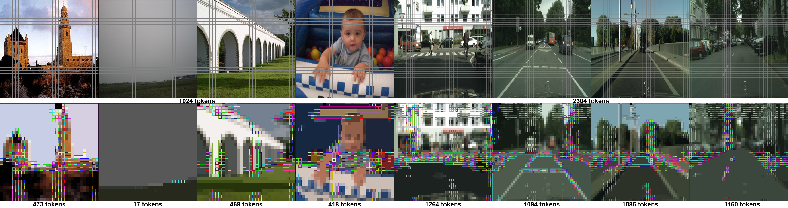
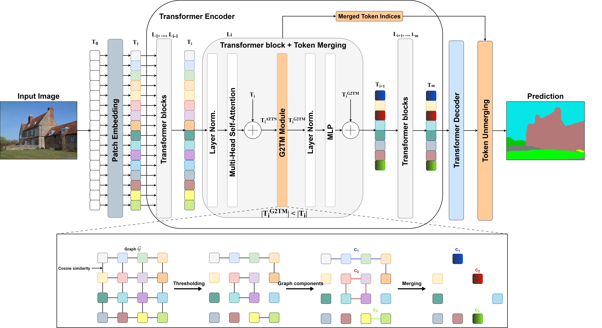

# G2TM: Single-Module Graph-Guided Token Merging for Efficient Semantic Segmentation



<p align="center">
  <br> <strong>Authors:</strong> <a href="https://orcid.org/0009-0006-0682-8927">Victor BERCY</a>, <a href="https://orcid.org/0000-0002-5102-7735">Martyna POREBA</a>, <a href="https://orcid.org/0009-0000-9061-4396">Michal SZCZEPANSKI</a>, <a href="https://orcid.org/0000-0002-2860-8128">Samia BOUCHAFA</a>
</p>

<p align="center">
  <!-- Python version -->
  

  <!-- Pytorch version -->
  

  <!-- Licence -->
  
</p>

<p align="center">
  <!-- Article -->
  <a href="https://cea.hal.science/cea-05578363">
    
  </a>
  <!-- Extension -->
  <a href="#">
    
  </a>
</p>

<div align="center" style="background: linear-gradient(135deg, #667eea 0%, #764ba2 100%); padding: 20px; border-radius: 8px; color: white; margin-bottom: 20px; box-shadow: 0 2px 10px rgba(0,0,0,0.1); font-family: -apple-system, BlinkMacSystemFont, 'Segoe UI', Helvetica, Arial, sans-serif;">
  <h2 style="margin: 0; font-weight: 600;"><strong>🚀 Update available</strong></h2>
  <p style="margin: 8px 0 0">
    <strong>G2TM can now be run with PyTorch 2.11.0 and be exported to ONNX!</strong>
  </p>
</div>

Graph-Guided Token Merging (G2TM) is a lightweight one-shot module designed to eliminate redundant tokens early in the ViT architecture. It performs a single merging step after a shallow attention block, enabling all subsequent layers to operate on a compact token set. It leverages graph theory to identify groups of semantically redundant patches.



## Choose your model

**The `main` branch only contains this overview.** Each adapted model has its own branch: pick the model you want to use below, then follow the README of its branch for installation, training, inference, benchmarking, token visualization, ONNX export and results.

| Task | Model | Branch | Datasets | Get started |
|:------:|:-------:|:--------:|:----------:|:-------------:|
| Semantic segmentation | [Segmenter](https://arxiv.org/abs/2105.05633) (Linear and Mask Transformer decoders) | [`segm`](https://github.com/vbercy/g2tm/tree/segm) | ADE20K, Cityscapes, Pascal Context | [README](https://github.com/vbercy/g2tm/blob/segm/README.md) · [Results](https://github.com/vbercy/g2tm/blob/segm/RESULTS.md) |
| Semantic segmentation | [SETR](https://arxiv.org/abs/2012.15840) (Naive, PUP and MLA decoders) | [`setr`](https://github.com/vbercy/g2tm/tree/setr) | ADE20K, Cityscapes, Pascal Context | [README](https://github.com/vbercy/g2tm/blob/setr/README.md) · [Results](https://github.com/vbercy/g2tm/blob/setr/RESULTS.md) |
| Semantic/Instance/Panoptic segmentation | [EoMT](https://arxiv.org/abs/2503.19108) | [`eomt`](https://github.com/vbercy/g2tm/tree/eomt) | ADE20K, Cityscapes, COCO | [README](https://github.com/vbercy/g2tm/blob/eomt/README.md) · [Results](https://github.com/vbercy/g2tm/blob/eomt/RESULTS.md) |
| Image classification | [Vision Transformer](https://arxiv.org/abs/2010.11929) | [`cls`](https://github.com/vbercy/g2tm/tree/cls) | ImageNet-1k, CIFAR-100, Oxford Flowers, Oxford Pets | [README](https://github.com/vbercy/g2tm/blob/cls/README.md) · [Results](https://github.com/vbercy/g2tm/blob/cls/RESULTS.md) |

You can clone only the branch you need:

```bash
# Segmenter + G2TM
git clone -b segm --single-branch https://github.com/vbercy/g2tm g2tm-segm

# SETR + G2TM
git clone -b setr --single-branch https://github.com/vbercy/g2tm g2tm-setr

# EoMT + G2TM
git clone -b eomt --single-branch https://github.com/vbercy/g2tm g2tm-eomt

# ViT + G2TM
git clone -b cls --single-branch https://github.com/vbercy/g2tm g2tm-vit
```

Each branch has its own conda environment (`g2tm_segm`, `g2tm_setr`, `g2tm_eomt` and `g2tm_vit` respectively), so the four models can be installed side by side.

## What is common to all branches?

Every branch ships the same core `g2tm` Python package, which provides:

- three interchangeable implementations of the merging module, which produce the same token groups: NetworkX connected components, a custom BFS (the fastest for PyTorch inference), and a tensorized FastSV algorithm (the fastest for batched training, and the one that can be exported to ONNX);
- token unmerging to recover the original token grid (used before the decoder for semantic segmentation, and not needed for classification);
- token and attention map visualization utilities.

The model code, training and evaluation pipelines, datasets and dependencies differ from one branch to another.

## Acknowledgements

This work builds upon the official [Segmenter](https://github.com/rstrudel/segmenter), [SETR](https://github.com/fudan-zvg/SETR), [EoMT](https://github.com/tue-mps/eomt) and [Vision Transformer](https://github.com/google-research/vision_transformer) code, as well as [ToMe](https://github.com/facebookresearch/ToMe), [ALGM](https://github.com/tue-mps/algm-segmenter), [timm](https://github.com/huggingface/pytorch-image-models), [mmsegmentation](https://github.com/open-mmlab/mmsegmentation) and [mmcv](https://github.com/open-mmlab/mmcv). The exact third-party code and licences used by each model are listed in the README of its branch.

## License

G2TM is released under the Apache 2.0 licence:

```
  Copyright © 2025 Commissariat à l'Energie Atomique et aux Energies Alternatives (CEA)

  Licensed under the Apache License, Version 2.0 (the "License");
  you may not use this file except in compliance with the License.
  You may obtain a copy of the License at

      http://www.apache.org/licenses/LICENSE-2.0

  Unless required by applicable law or agreed to in writing, software
  distributed under the License is distributed on an "AS IS" BASIS,
  WITHOUT WARRANTIES OR CONDITIONS OF ANY KIND, either express or implied.
  See the License for the specific language governing permissions and
  limitations under the License.
```

Each branch contains third-party code under its own licence. Refer to the `LICENSE` file of the branch you use.

## Citation

If you cite G2TM or use this repository in your work, please cite:

```
@conference{bercy2026g2tm,
       author={Victor Bercy and Martyna Poreba and Michal Szczepanski and Samia Bouchafa},
       title={G2TM: Single-Module Graph-Guided Token Merging for Efficient Semantic Segmentation},
       booktitle={Proceedings of the 21st International Conference on Computer Vision Theory and Applications - Volume 2: VISAPP},
       year={2026},
       pages={43-54},
       publisher={SciTePress},
       organization={INSTICC},
       doi={10.5220/0014267600004084},
       isbn={978-989-758-804-4},
       issn={2184-4321},
}
```
